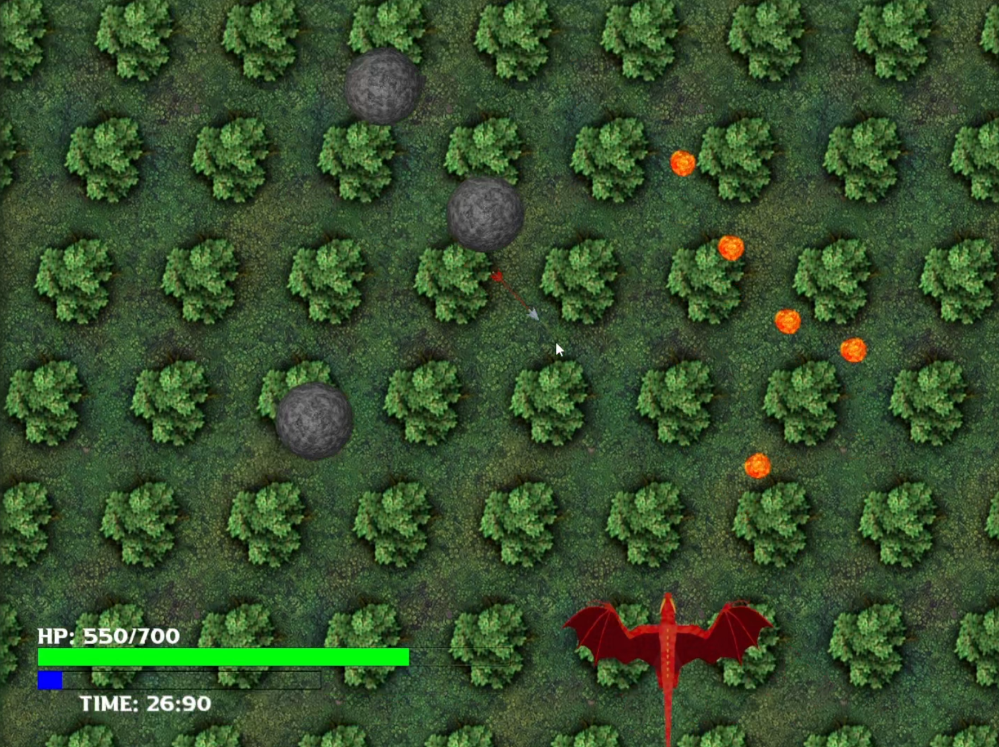
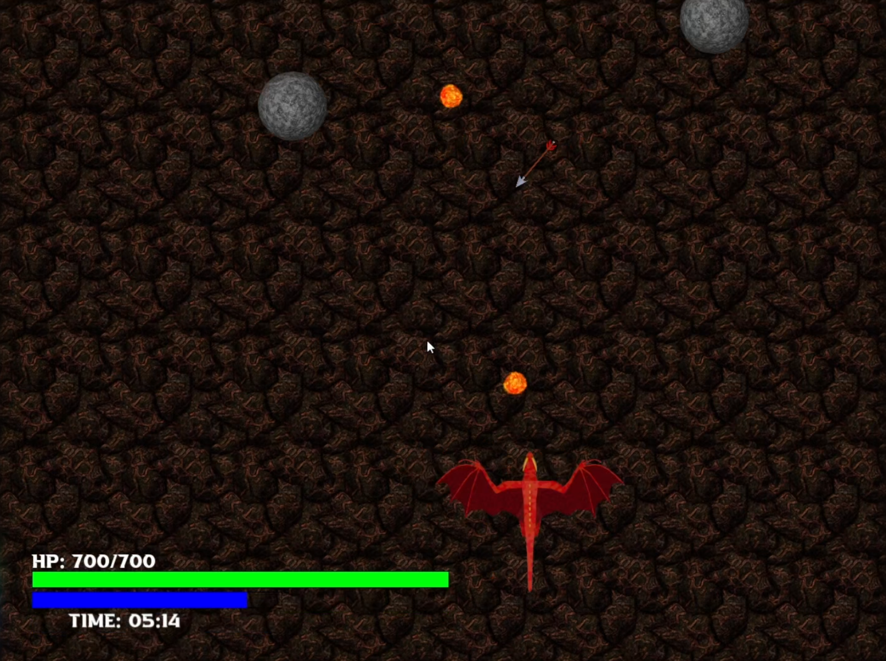

# Dragon
In this project, we created a game using OpenGL, where players control a dragon flying through a dynamic environment. The main objective is to navigate the dragon around various obstacles and avoid objects thrown at it. The gameplay is designed to have increasing difficulty as players progress.

### Key Features:
- **Character Design**: The dragon character was modeled in Blender, with different positions of the wings being exported for creating a fluid flying motion, all arranged in sequence as sprites.
- **Dynamic Obstacles**: The weapons thrown at the dragon were also modeled in Blender, ensuring consistency in design and animation. These weapons arrive from different windows, creating a more challenging and unpredictable gameplay experience.
- **Health Points System**: The game incorporates a health points system for the dragon, adding a layer of strategy as players must avoid obstacles to maintain their health.
- **Collectible Power-Ups**: Players can collect power-ups throughout the game, providing temporary boosts that enhance gameplay and increase the dragon's abilities.
- **Theme Customization**: Players have the option to choose the background theme, enhancing the visual appeal and allowing for a more personalized gaming experience.

---

## Credits
This game was created by:
- Alberto Cagnazzo
- Giulio Arecco
- Erika Astegiano
